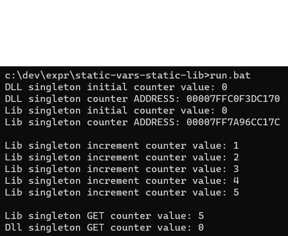
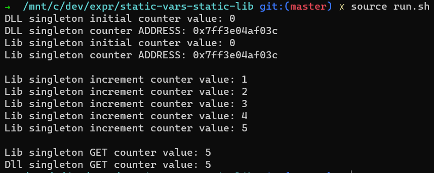

# Static variables in static libraries and DLLs

This project shows how static variable linkage work differently under Windows & Linux OSs.

## Build & Run:  
Windows:
```shell
build.bat
run.bat
```

Linux:  
```shell
source build.sh
source run.sh
```

### Windows run
  

### Linux run
